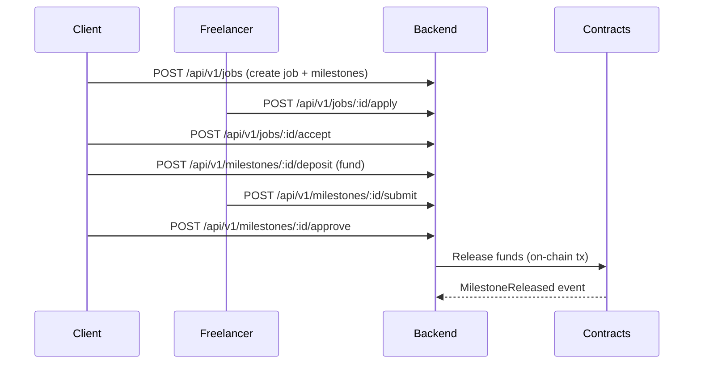

# CredLedger — Project Overview

High-level reference for the monorepo (frontend, backend, contracts) and how the pieces fit together.

## System Goals
- End-to-end freelance escrow with on/off-chain signals (UPI webhook stub → on-chain escrow → release/dispute flows).
- Clear separation of concerns: UI (React), API (Express + Mongo), Contracts (Hardhat on Sepolia).
- Secure auth (JWT access/refresh) and predictable milestone tracking.

## Architecture
- Clients (web) talk to Backend REST API over HTTPS.
- Backend persists business data in MongoDB and orchestrates escrow state with Sepolia contracts via ethers v6.
- Webhooks: UPI payment provider would call backend to mark off-chain payments; currently stubbed for local/testing.
- Contracts emit events; backend stores transaction metadata for auditability.

### Architecture Diagram
```mermaid
flowchart LR
  User[User (Client/Freelancer)] -->|HTTPS| API[Backend API /api/v1]
  API -->|Mongo| DB[(MongoDB)]
  API -->|ethers v6| Contracts[Sepolia Contracts]
  Webhook[UPI Webhook Provider] -->|POST /api/v1/webhooks/upi| API
  Contracts -->|Events| API
```

### Escrow Flow (Happy Path)


## Workspaces
- Root scripts (npm workspaces): install all deps, start dev servers, build contracts.
- Backend: TypeScript Express app with Mongoose models for jobs/milestones/users/transactions.
- Contracts: Hardhat project with EscrowFactory + FreelanceEscrow + DisputeDAO; TypeChain bindings checked in.
- Frontend: React 19 + Vite + Tailwind; consumes backend API and shows escrow lifecycle.

## API Surface (v1)
Method | Path | Auth | Notes
--- | --- | --- | ---
POST | /api/v1/auth/register | none | Email/phone + password, role CLIENT/FREELANCER.
POST | /api/v1/auth/login | none | Returns access + refresh tokens.
GET | /api/v1/auth/me | Bearer access | Current user profile.
GET | /api/v1/jobs | optional | List recent jobs (50).
POST | /api/v1/jobs | CLIENT | Create job with milestones.
GET | /api/v1/jobs/:jobId | optional | Job detail + milestones.
POST | /api/v1/jobs/:jobId/apply | FREELANCER | Apply with cover letter + bid.
POST | /api/v1/jobs/:jobId/accept | CLIENT | Accept freelancer; moves job to IN_PROGRESS.
POST | /api/v1/jobs/:jobId/milestones | CLIENT | Append milestone; adjusts budget.
GET | /api/v1/milestones/:id | Bearer | Milestone + parent job snapshot.
POST | /api/v1/milestones/:id/deposit | CLIENT | Simulated funding; records transaction.
POST | /api/v1/milestones/:id/submit | FREELANCER | Submit work.
POST | /api/v1/milestones/:id/approve | CLIENT | Approve submission.
POST | /api/v1/milestones/:id/release | CLIENT/ADMIN/ARBITRATOR | Release funds (on-chain hook placeholder).
POST | /api/v1/milestones/:id/dispute | CLIENT/FREELANCER | Move milestone to DISPUTED.
POST | /api/v1/milestones/:id/refund | CLIENT/ADMIN/ARBITRATOR | Refund path.
POST | /api/v1/webhooks/upi | signature header | Raw body required; verifies HMAC only (stub processing).

## Data Model Summary
- Job: clientId, title, description, skills, budget (INR), status {DRAFT, OPEN, IN_PROGRESS, COMPLETED, CANCELLED}, selectedFreelancerId, applications[{freelancerId, bidPaise, status}], escrow{escrowId, chainId, contractAddress}.
- Milestone: jobId, index, title, description, amountPaise, status {DRAFT, AWAITING_FUNDING, FUNDED_PENDING_CHAIN, FUNDED, SUBMITTED, APPROVED, REJECTED, RELEASE_AUTHORIZED, RELEASED, DISPUTED, REFUND_AUTHORIZED, REFUNDED}, submission{message, submitHash, attachments}, approval{approvedAt}, chain{escrowAddress, milestoneIdOnchain, lastTxHash}.
- Transaction: type {UPI_COLLECT, UPI_PAYOUT, CHAIN_TX}, jobId, milestoneId, userId, amountPaise, status {CREATED, PENDING, SUCCESS, FAILED, REVERSED}, provider{orderId,paymentId,signature,rawWebhookIds}, chain{chainId,txHash,contractAddress,eventName}, idempotencyKey.
- User: role {CLIENT, FREELANCER, ADMIN, ARBITRATOR}, email/phone, passwordHash, walletAddress, kyc{status,providerRef,submittedAt,verifiedAt}, upi{vpa,payoutProfileId}, profile{name,bio,skills[]}.

## Contract Addresses (Sepolia)
Contract | Address | Deployed Block/Tx | Notes
--- | --- | --- | ---
EscrowFactory | TODO | TODO | Update backend/frontend configs.
FreelanceEscrow (instances) | deployed per job | - | Spawned via EscrowFactory.
DisputeDAO | TODO | TODO | Arbitrator hooks.

## Environment Config
Key | Scope | Required | Purpose
--- | --- | --- | ---
PORT | backend | optional | HTTP port (default 8080).
NODE_ENV | backend | optional | Runtime mode.
MONGODB_URI | backend | yes | Mongo connection string.
JWT_ACCESS_SECRET | backend | yes | Signs short-lived access tokens.
JWT_REFRESH_SECRET | backend | yes | Signs long-lived refresh tokens.
SEPOLIA_RPC_URL | backend/contracts | yes | RPC endpoint for Sepolia.
OPERATOR_PRIVATE_KEY | backend | yes | Operator key for contract calls.
ESCROW_FACTORY_ADDRESS | backend/frontend | yes after deploy | Factory address for creating escrows.
UPI_WEBHOOK_SECRET | backend | yes | HMAC key for webhook signature verification.
DEPLOYER_PRIVATE_KEY | contracts | yes | Deployer key for Hardhat deploy.

## Flows
- Happy path: create job → freelancer applies → client accepts → client funds milestone → freelancer submits → client approves → backend/contract releases → funds recorded in transactions.
- Dispute path: after submission/approval, either party disputes → milestone moves to DISPUTED → admin/arbitrator can release or refund → transaction recorded.
- Webhook path: provider posts to /api/v1/webhooks/upi with HMAC header → backend verifies signature → TODO: parse payload, update Transaction + Milestone state idempotently.

## Testing Matrix
- Contracts: Hardhat tests in `contracts/test`; run `npm run test` inside `contracts/`.
- Backend: TODO add API/unit tests (supertest/jest) for auth, jobs, milestones, webhooks.
- Frontend: TODO add component/E2E coverage; lint via `npm run lint`.

## Troubleshooting
- Mongo unreachable: check MONGODB_URI and local Mongo service; verify network/firewall.
- 401 on protected routes: ensure Authorization: Bearer accessToken; tokens expire after 30m.
- Wrong factory address: update ESCROW_FACTORY_ADDRESS in backend/frontend after deploy; redeploy/restart backend.
- Webhook signature fails: confirm UPI_WEBHOOK_SECRET matches provider; raw body must be preserved (app mounts webhook before JSON parser).
- RPC errors/rate limits: verify SEPOLIA_RPC_URL and private key permissions; consider retry/backoff.

## Security Notes
- JWT rotation: refresh tokens last 30d; access tokens 30m—consider revocation lists/blacklist if adding logout.
- Webhooks: uses timingSafeEqual HMAC verification; still TODO to parse payload and enforce idempotency keys.
- Contracts: FreelanceEscrow uses OpenZeppelin ReentrancyGuard; keep operator key secure and scoped.
- Secrets: never commit .env; use environment-level secret storage in deployment.

## Backend Details
- Entry: `backend/src/app.ts` (Express app) and `backend/src/server.ts` (server bootstrap).
- Key middleware: auth (JWT access/refresh), error handler, validation via Zod in controllers (add as needed).
- Models: Job, Milestone, Transaction, User (Mongoose schemas).
- Routes: auth, jobs, milestones, webhooks; mounted under `/api` (see app.ts for exact prefix).
- Config: `backend/src/config/env.ts` loads `.env`; `mongo.ts` connects MongoDB.
- Auth: access/refresh JWT secrets required; tokens issued/validated in auth routes.
- Health: `GET /health` returns liveness (useful for deployment checks).

## Contracts Details
- Networks: Sepolia (default). Update `.env` with RPC + deployer key.
- Main contracts:
  - EscrowFactory: deploys FreelanceEscrow instances per job.
  - FreelanceEscrow: holds funds, supports fund → release → dispute flows; guarded by OpenZeppelin ReentrancyGuard.
  - DisputeDAO: simple arbitrator interface for disputes (see TypeChain bindings under `typechain-types/contracts/DisputeDAO.sol`).
- Build/Test/Deploy: `npm run build`, `npm run test`, `npm run deploy:sepolia` inside `contracts/`.
- Artifacts and TypeChain outputs are committed under `contracts/artifacts` and `contracts/typechain-types` for frontend/backend consumption.

## Frontend Details
- Entry: `frontend/src/main.tsx`; router/UI lives in `App.tsx`.
- Styling: Tailwind; global styles in `index.css`/`App.css`.
- API helper: `frontend/src/api.ts` centralizes backend base URL + request helpers.
- Assets: `frontend/src/assets/`.
- Dev server: Vite on port 5173.

## Environment & Secrets
- Backend `.env` (copy from `.env.example`): Mongo URI, JWT secrets, Sepolia RPC URL, operator key, EscrowFactory address, UPI webhook secret.
- Contracts `.env` (copy from `.env.example`): Sepolia RPC URL, deployer private key.
- Update `ESCROW_FACTORY_ADDRESS` in backend/frontend after deploying contracts.

## Common Commands
- Root: `npm install --workspaces` to install all packages.
- Backend: `npm run dev` (watch), `npm run build`, `npm start` (prod build).
- Contracts: `npm run build`, `npm run test`, `npm run deploy:sepolia`.
- Frontend: `npm run dev`, `npm run build`, `npm run preview`, `npm run lint`.

## Local Dev Workflow
1) Install deps: `npm install --workspaces` from root.
2) Backend: copy `.env.example` → `.env`, fill secrets; run `npm run dev` in `backend/` (http://localhost:8080).
3) Frontend: run `npm run dev` in `frontend/` (http://localhost:5173); point API base URL to backend.
4) Contracts: copy `.env.example` → `.env`; `npm run build` then `npm run test` in `contracts/`. Deploy when ready and propagate EscrowFactory address.

## Deployment Notes
- Build backend (`npm run build`) and serve compiled output; ensure Mongo + environment secrets are available.
- Contracts: deploy to Sepolia via `npm run deploy:sepolia`; persist addresses in backend/frontend configs.
- Frontend: `npm run build` → deploy `dist/` to static hosting.
- Set health check to `/health` on backend.

## Testing
- Contracts: Hardhat tests via `npm run test` (see `contracts/test`).
- Backend/Frontend: add tests as implemented; lint frontend via `npm run lint`.

## Next Steps
- Add end-to-end tests covering escrow lifecycle (create, fund, release, dispute).
- Wire real UPI webhook verification and signature checks.
- Expand frontend flows for disputes and admin/arbitration controls.
